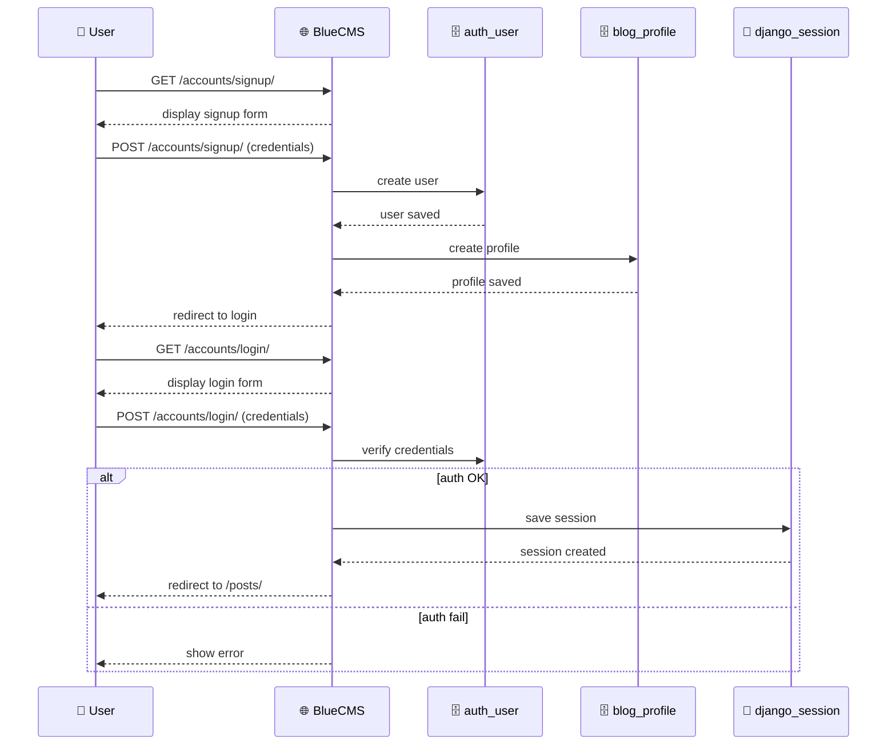

# DataFlow: アカウント作成とログインのデータフロー

以下では、新規アカウント作成（Sign Up）とログイン（Login）時のデータの流れを簡潔に説明します。

## 新規アカウント作成の流れ
1. ユーザーが `/accounts/signup/` にGETリクエスト
2. BlueCMSがサインアップフォームを返却
3. ユーザーが認証情報（ユーザー名・パスワード）をPOST
4. BlueCMSが `auth_user` テーブルにユーザーを登録
5. BlueCMSが `blog_profile` テーブルにプロフィールを登録
6. サインアップ完了後、ログインページへリダイレクト

## ログインの流れ
1. ユーザーが `/accounts/login/` にGETリクエスト
2. BlueCMSがログインフォームを返却
3. ユーザーが認証情報（ユーザー名・パスワード）をPOST
4. BlueCMSが `auth_user` テーブルで認証情報を検証
5. 認証成功なら `django_session` テーブルにセッションを保存し、投稿一覧画面へリダイレクト
6. 認証失敗ならエラーメッセージを表示

